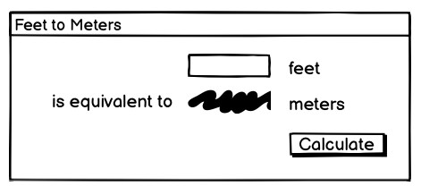
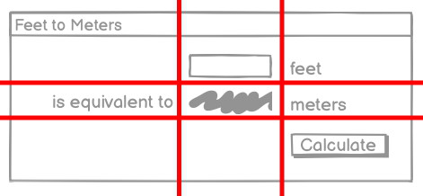

# ArenaValor_Sweepstakes
王者荣耀皮肤抽奖模拟

## 免责声明
本demo仅供娱乐，不允许用于商业用途，如官方不允许，请联系我删除。

## 框架搭建思路

### UI界面搭建

#### UI库的选择

* 选择官方自带tkinter库实现UI界面的实现，选择原因主要如下：
    * 界面不需要多华丽，能实现功能即可
    * 正好学习下UI库的使用，官方库虽然简陋，但胜在教程多，功能稳定，便于了解基础知识
* tkinter库官方文档： 
  * [TkDocs](https://tkdocs.com/tutorial/index.html)
  * [Tkinter Commands](https://tcl.tk/man/tcl8.6/TkCmd/contents.htm)

#### tkinter库学习

    界面布局，假设要实现以下界面：

    查看布局。我们包含的小部件似乎自然地被划分为一个有三列和三行的网格。在布局方面，事物似乎自然而然地分为三列三行，如下图所示：

    Widget（小控件）
* 小控件一些最有用的方法：
  * winfo_class: 标识小部件类型的类，例如，用于主题按钮TButton
  * winfo_children: 作为层次结构中小组件的直接子级的小组件列表
  * winfo_parent: 层次结构中小组件的父级
  * winfo_toplevel: 包含此小部件的顶级窗口
  * winfo_width, winfo_height: 小部件的当前宽度和高度;在它出现在屏幕上之前不准确
  * winfo_reqwidth, winfo_reqheight: 小部件请求几何管理器的宽度和高度（稍后会详细介绍）
  * winfo_x, winfo_y: 小组件的左上角相对于其父级的位置
  * winfo_rootx, winfo_rooty: 小组件左上角相对于整个屏幕的位置
  * winfo_vieweable: 小组件是显示还是隐藏（其在层次结构中的所有祖先都必须是可见的，才能可见）

    几何管理器（The Grid Geometry Manager）
    Tk 中的几何体管理依赖于主从小部件的概念。主控版是小部件， 通常为顶级应用程序窗口或框架。它包含其他小部件，称为从属设备。

    事件处理
    与大多数用户界面工具包一样，Tk 运行一个事件循环，该循环从 操作系统。这些操作包括按钮按下、击键、鼠标移动、窗口大小调整等。

    命令回调
    您通常希望程序以特定方式处理某些事件，例如，当按钮按下。

    绑定到事件及事件的多个绑定
    对于没有关联特定于 widget 的命令回调的事件，您可以使用 Tk 来捕获任何 事件，然后（如回调）执行任意一段代码。
* 最常用的事件，以及生成这些事件的情况：
    * <Activate>: 窗口已变为活动状态。
    * <Deactivate>: 窗口已停用。
    * <MouseWheel>: 鼠标上的滚轮已移动。
    * <KeyPress>: 键盘上的键已被按下。
    * <KeyRelease>: 密钥已释放。
    * <ButtonPress>: 已按下鼠标按钮。
    * <ButtonRelease>: 已释放鼠标按钮。
    * <Motion>: 鼠标已被移动。
    * <Configure>: 小组件的大小或位置已更改。
    * <Destroy>: 小部件正在被破坏。
    * <FocusIn>: Widget 已被赋予键盘焦点。
    * <FocusOut>: Widget 已失去键盘焦点。
    * <Enter>: 鼠标指针进入小部件。
    * <Leave>: 鼠标指针离开小部件。

### 数据源获取

素材采取自王者荣耀素材库（https://pvp.icreate.qq.com/）
https://lcmimage.ecology.smoba.qq.com/public/15c7b7f84e6a3c3703b38799d65cd06a.jpg?sign=1709432488-bUfKho-0-04b038ec453e0a4c109e16a30168c1c0&download_name=files.jpg